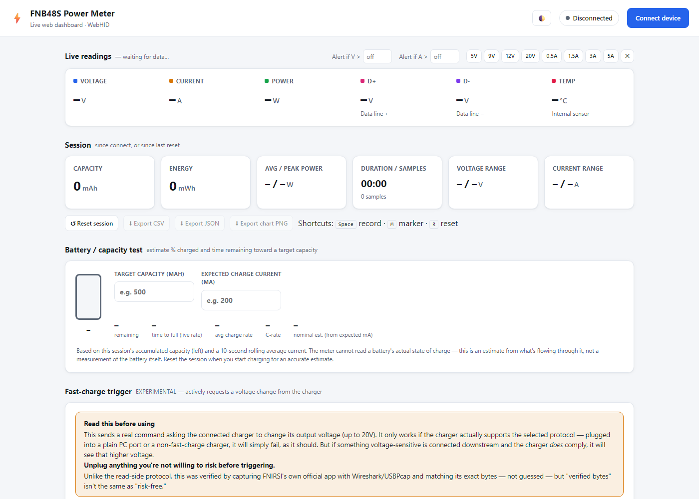

# ⚡ FNB48S Web Dashboard

**Live browser dashboard for the FNIRSI FNB48S USB power meter (WebHID)**
hiibrarahmad


## 📖 Overview

A single-page dashboard that talks directly to the FNIRSI FNB48S over USB using the
browser's WebHID API — no drivers, no companion app, no data leaving the machine.
It reads live voltage/current/power/D±/temperature off the meter's 64-byte HID
report stream, and can also request a fast-charge voltage (QC/FCP/SCP/AFC) using
command bytes captured directly from FNIRSI's own desktop app.

```
   ┌──────────────────────┐   WebHID (USB)   ┌───────────────────────────┐
   │   Browser tab         │ ───────────────► │   FNIRSI FNB48S            │
   │   index.html           │ ◄─────────────── │   PC-link USB-C port       │
   │   (this repo)          │  64-byte reports  │   (not the pass-through)   │
   └──────────────────────┘                   └───────────────────────────┘
                                                          │  pass-through
                                                          ▼
                                                  charger ──► load
```

## 🖼️ Screenshot



<!-- A device photo will go here once available — see docs/ for details. -->

## 🔌 Protocol

| Field | Bytes | Notes |
|---|---|---|
| Report marker | `0xAA` | First byte of every 64-byte HID report |
| Packet type | `0x04` | Data packet; others ignored |
| Voltage / Current | int32 LE ÷ 100000 | Per 15-byte sample, 4 samples/report |
| D+ / D- | int16 LE ÷ 1000 | Same sample |
| Temperature | int16 LE ÷ 10 | Same sample |
| Checksum | CRC-8 (poly `0x39`, init `0x42`) | Last byte of the report |

**Fast-charge trigger** (`0x88` command, gated behind an explicit warning in the UI):
verified by capturing FNIRSI's own app with Wireshark/USBPcap while triggering each
protocol and matching its output byte-for-byte, including its checksum — not guessed.

| Protocol | ID |
|---|---|
| QC 2.0 | `0x00` |
| QC 3.0 | `0x01` |
| Huawei FCP | `0x02` |
| Huawei SCP | `0x03` |
| Samsung AFC | `0x04` |

## 📁 Layout

```
index.html      ← the entire app — open it directly, or serve it, either works
README.md
docs/
├── screenshot.png    ← dashboard screenshot
└── device.jpg        ← meter photo
```

> **Note**
> Everything runs client-side in the one HTML file. There's no build step, no
> server, and no dependency install — `index.html` is the whole application.

## 🧭 Evolution

| Date | Change |
|---|---|
| 2026-09-18 | Diagnosed the "no device found" issue down to the meter's two separate USB ports (pass-through vs. PC-link) |
| 2026-09-18 | Read-side HID protocol implemented from a known-good byte layout; live V/A/W/D±/temp working |
| 2026-09-19 | Fixed a missing keep-alive packet that was cutting the stream off after ~2s |
| 2026-09-19 | Added battery/capacity estimator, session recording, event markers, replay |
| 2026-09-20 | Captured FNIRSI's official app over USB with Wireshark/USBPcap to verify the fast-charge trigger bytes (QC/FCP/SCP/AFC) — replacing guesswork with confirmed values |
| 2026-09-22 | Published and deployed to GitHub Pages |

## 🚀 Usage

Open [the live demo](https://hiibrarahmad.github.io/fnb48s-web-dashboard/) in Chrome
or Edge on desktop, or download `index.html` and open it locally — both work
identically. Connect the FNB48S via its dedicated PC-link USB-C port, click
**Connect device**, and pick it from the browser's picker.

WebHID isn't available in Firefox/Safari or on mobile browsers.

This is an independent, unofficial client and is not affiliated with FNIRSI.

---

© 2026 hiibrarahmad. Licensed under MIT.
